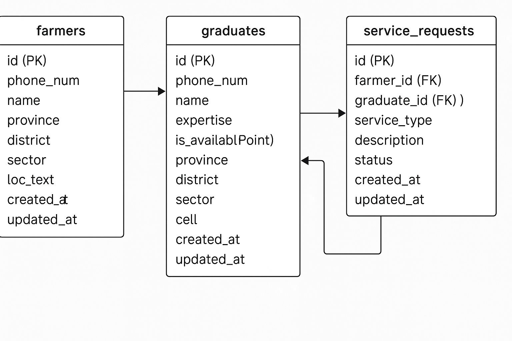

# AgriVet USSD Platform - Preliminary Version (MVP)

## 1. Project Description

The AgriVet platform is a technology-enabled initiative designed to bridge critical information and service gaps for smallholder farmers in Rwanda. It aims to enhance agricultural productivity and veterinary services by connecting farmers with localized agro-climatic data, expert agronomic and veterinary advice, and a network of skilled local graduates.

This repository represents the **preliminary version (Minimum Viable Product - MVP)** of the AgriVet solution, focusing on the core **USSD (Unstructured Supplementary Service Data) application**. The USSD system is chosen for its widespread accessibility in rural areas, not requiring smartphones or internet access. It enables farmers to register and initiate service requests, laying the foundation for a comprehensive digital extension service.

While the primary focus of this MVP is the USSD backend, a future **web application** is planned to facilitate graduate registration, administrative management, and potentially a richer interface for certain farmer services.

## 2. GitHub Repository Link

**Repository:** [https://github.com/Euwamahoro/agrivet-ussd.git](https://github.com/Euwamahoro/agrivet-ussd.git)

## 3. How to Set Up the Environment and the Project

This section details how to get the AgriVet USSD backend application running locally for development and testing.

### Prerequisites

Before you begin, ensure you have the following installed:

*   **Node.js (v18 or higher):** [Download Node.js](https://nodejs.org/en/download/)
*   **PostgreSQL (v14 or higher):** [Download PostgreSQL](https://www.postgresql.org/download/)
    *   Ensure the **PostGIS extension** is installed and enabled for your database.
*   **Git:** [Download Git](https://git-scm.com/downloads)

### Setup Steps

1.  **Clone the Repository:**
    
    Navigate to your desired directory and clone the project:
    
    ```bash
    git clone https://github.com/Euwamahoro/agrivet-ussd.git
    cd agrivet-ussd
    ```

2.  **Install Node.js Dependencies:**
    
    Install all required packages listed in `package.json`:
    
    ```bash
    npm install
    ```
    
    (This includes `express`, `pg`, `sequelize`, `dotenv`, `axios`, `i18n`, `sequelize-cli`, `nodemon`).

3.  **Database Setup (PostgreSQL with PostGIS):**
    
    *   Create a new PostgreSQL user and a database for the application. Ensure the PostGIS extension is enabled on this database. You can do this via `psql` or a GUI tool like pgAdmin.
        
        ```sql
        -- Connect as a superuser (e.g., 'postgres') first
        CREATE USER agrivetuser WITH PASSWORD 'your_secure_db_password';
        CREATE DATABASE agrivet_ussd_db OWNER agrivetuser;
        \c agrivet_ussd_db; -- Connect to the newly created database
        CREATE EXTENSION postgis;
        -- Grant necessary privileges
        GRANT ALL PRIVILEGES ON ALL TABLES IN SCHEMA public TO agrivetuser;
        GRANT ALL PRIVILEGES ON ALL SEQUENCES IN SCHEMA public TO agrivetuser;
        GRANT ALL PRIVILEGES ON ALL FUNCTIONS IN SCHEMA public TO agrivetuser;
        ```
    
    *   **Important:** Replace `'your_secure_db_password'` with a strong password.

4.  **Configure Environment Variables:**
    
    Create a `.env` file in the root directory of your project (`agrivet-ussd/.env`). Populate it with your database credentials and the Intellex API keys you obtained.
    
    ```env
    PORT=3000

    DB_HOST=localhost
    DB_PORT=5432
    DB_USER=agrivetuser
    DB_PASSWORD=your_secure_db_password
    DB_NAME=agrivet_ussd_db

    # Intellex API Keys (REPLACE WITH YOUR ACTUAL KEYS)
    INTELLEX_PROVINCES_API_KEY=apk_ad8a61e0-bdea-4721-995e-b036cca8d224
    INTELLEX_DISTRICTS_API_KEY=apk_0a645812-86b9-4a28-bf85-1c720b7f84ca
    INTELLEX_SECTORS_API_KEY=apk_6ddd733f-a250-479d-a3bb-7bdf4171962f
    INTELLEX_CELLS_API_KEY=apk_a5a41bfb-a42f-40f3-977e-6da12e2dfa17
    ```
    
    **Security Note:** The `.env` file is excluded from version control by `.gitignore` to protect sensitive credentials.

5.  **Run Database Migrations:**
    
    Apply the database schema changes defined in the `db/migrations` folder:
    
    ```bash
    npm run migrate
    ```

6.  **Add a Test Graduate (Manual Insertion for Phase 4 Testing):**
    
    Since graduate registration is planned for a web application, manually insert a test graduate into your `graduates` table directly via SQL. This is crucial for testing the service request and matching functionalities in Phase 4.
    
    ```sql
    INSERT INTO graduates (id, phone_number, name, expertise, is_available, province, district, sector, cell, location, created_at, updated_at)
    VALUES (
        'a0eebc99-9c0b-4ef8-bb6d-6bb9bd380a11', -- Use a unique UUID for each graduate
        '+250788123456', -- Use a unique phone number
        'Expert Agronomist',
        'agronomy',
        TRUE,
        'Kigali',      -- Match a valid province from Intellex API
        'Nyarugenge',  -- Match a valid district
        'Gitega',      -- Match a valid sector
        'Kora',        -- Match a valid cell
        ST_SetSRID(ST_MakePoint(30.0667, -1.9441), 4326), -- Example coordinates for Kigali (Lon, Lat)
        NOW(),
        NOW()
    );
    ```
    
    **Important:** Adjust `province`, `district`, `sector`, `cell` to match an actual location returned by the Intellex API and where you intend to register your test farmer.

7.  **Start the Application:**
    
    Run the application in development mode (with `nodemon` for auto-restarts on code changes):
    
    ```bash
    npm run dev
    ```
    
    You should see output similar to:
    
    ```
    Database synced successfully.
    AgriVet USSD server running on port 3000
    ```
    
    You can also visit `http://localhost:3000` in your web browser for a basic health check.

### Testing the USSD Flow Locally

To test the USSD application, you'll need to simulate requests from a USSD gateway using an HTTP client like Postman, Insomnia, or `curl`.

*   **Method:** `POST`
*   **URL:** `http://localhost:3000/ussd`
*   **Headers:** `Content-Type: application/x-www-form-urlencoded`
*   **Body (Form Data - Key-Value Pairs):**

**Key Scenarios to Test:**

1.  **Initial Dial (New Session):**
    *   `sessionId`: `AGRIVET_SESSION_001` (Use a unique ID for each session)
    *   `phoneNumber`: `+250788999888` (Use a new phone number for a new farmer)
    *   `text`: (leave empty)
    *   **Expected:** Language selection menu.

2.  **Language Selection (e.g., English):**
    *   `sessionId`: `AGRIVET_SESSION_001`
    *   `phoneNumber`: `+250788999888`
    *   `text`: `1` (or the option for English)
    *   **Expected:** English Main Menu, with "1. Register as Farmer".

3.  **Farmer Registration (Full Flow):**
    *   Continue from above: Select `1` for "Register as Farmer".
    *   Follow prompts for `name`, then `province`, `district`, `sector`, `cell`, selecting options numerically.
    *   **Expected:** A success message confirming registration and session termination (`END`).
    *   **Verification:** Check your `farmers` table in PostgreSQL for the new entry.

4.  **Registered Farmer - Dynamic Main Menu:**
    *   `sessionId`: `AGRIVET_SESSION_002` (New session)
    *   `phoneNumber`: `+250788999888` (Use the number of the farmer you just registered)
    *   `text`: (empty) -> Select language (e.g., `1`)
    *   **Expected:** Main Menu, with "1. Update My Details" (instead of "Register as Farmer").

5.  **Update Farmer Name:**
    *   From the "Update My Details" menu, select option `1` (Update Name).
    *   Enter a new name.
    *   **Expected:** Success message and session termination.
    *   **Verification:** Check the `farmers` table for the updated name.

6.  **Update Farmer Location:**
    *   From the "Update My Details" menu, select option `2` (Update Location).
    *   Go through the full Province, District, Sector, Cell selection process again.
    *   **Expected:** Success message with new location and session termination.
    *   **Verification:** Check the `farmers` table for the updated location fields.

7.  **Service Request Initiation (Phase 4 Functionality - requires test graduate):**
    *   `sessionId`: `AGRIVET_SESSION_003` (New session)
    *   `phoneNumber`: `+250788999888` (Use registered farmer's number)
    *   `text`: (empty) -> Select language (e.g., `1`)
    *   From Main Menu, select `2` (Request Service).
    *   **Expected:** Service type selection menu.
    *   Select `1` (Agronomy) or `2` (Veterinary).
    *   **Expected:** Issue description prompt.
    *   Enter a description (e.g., "My crops are wilting.").
    *   **Expected:** Confirmation message with Request ID and session termination (`END`).
    *   **Verification:** Check your `service_requests` table for the new entry, and if a graduate was assigned.

## 4. Designs

### A. USSD System User Interface Design (Implemented - Primary Focus)

The design of the USSD interface is inherently text-based, prioritizing **simplicity, clarity, and accessibility** for users primarily on feature phones in rural Rwanda. Our design considerations include:

*   **Menu Structure and Depth:** The menu flow is structured hierarchically to guide users step-by-step through processes like farmer registration and service requests. For instance, the main menu offers high-level choices, and selecting "Register as Farmer" leads to a logical sequence of prompts (name, then province, then district, etc.). This ensures users are not overwhelmed by too many options at once.

*   **Message Clarity and Conciseness:** Given the limited screen space and text-only nature of USSD, messages are crafted to be as brief and unambiguous as possible. We avoid jargon and use direct, action-oriented language in prompts (e.g., "Please enter your full name:", "Select service type:"). This minimizes user confusion and reduces the number of interactions needed to complete a task.

*   **Intuitive Navigation Cues:** Users are always provided with clear numeric options for selection. For multi-step processes, a consistent "0. Back to Main Menu" option (or similar "back" prompt) is included to allow users to navigate freely. Explicit "Exit" options are provided to gracefully end a session.

*   **Internationalization Impact:** A core design principle has been **multilingual support** from the outset. The very first interaction prompts the user to select their preferred language (English, Kinyarwanda, or Kiswahili). All subsequent menu items, prompts, and confirmation messages are dynamically translated. This ensures the UI is immediately accessible and comfortable for diverse local communities, fostering broader adoption.

*   **User Experience (UX) for Feature Phones:** We've acknowledged the constraints of basic mobile phones:
    *   **Text-Only Interface:** No rich graphics, colors, or complex layouts are assumed. The focus is entirely on clear, readable text.
    *   **Step-by-Step Interaction:** USSD is session-based and sequential. The design breaks down complex tasks (like structured location entry) into manageable, single-input steps to prevent timeouts and reduce cognitive load.
    *   **Limited Input:** Numerical selection for menus and short text inputs for data are the primary interaction methods. Input validation is performed to guide users.

### B. Web Application User Interface Design (Preliminary Plan - Not Yet Developed)

While the web application is not yet developed, the design process will follow industry best practices, with a strong emphasis on user-centered design.

*   **Wireframes and Mockups:** We will begin with **wireframes** to outline the basic layout and functionality of key pages (e.g., Graduate Registration, Dashboard for AgriVet Admins/Graduates, Service Request Status). These will evolve into higher-fidelity **mockups** that incorporate visual styling.

*   **Style Guides:** A comprehensive style guide will be created to ensure consistency in branding, typography, color palettes, and component design across the entire web application.

*   **Responsiveness:** A critical design consideration for the web app will be **responsive design**. Wireframes and mockups will account for optimal display and usability across various screen sizes, from mobile phones (for potential field use by graduates) to tablets and desktop computers. This is crucial for reaching a broad user base with varying device preferences.

*   **Frontend Tools:** The frontend will be developed using **React with TypeScript** for building dynamic and interactive user interfaces. For specific pages or components requiring simpler, high-performance static content, **pure HTML combined with a utility-first CSS framework like Tailwind CSS** will be utilized to ensure rapid development and maintainable styling.

### C. Database Schema and Data Model

The AgriVet platform utilizes a **PostgreSQL database**, chosen for its robustness, reliability, and powerful **PostGIS extension**, which is essential for geospatial capabilities. We use **Sequelize** as our Object-Relational Mapper (ORM), allowing us to define models in JavaScript that map directly to our database tables.

Here's the schema for the core entities:

#### `farmers` Table
This table stores information about registered smallholder farmers.

*   **`id` (UUID, Primary Key):** Unique identifier for each farmer.
*   **`phone_number` (STRING, Unique, Not Null):** The farmer's mobile phone number, used as their primary identifier for USSD sessions.
*   **`name` (STRING, Not Null):** The farmer's full name.
*   **`province` (STRING, Not Null):** The name of the province the farmer resides in.
*   **`district` (STRING, Not Null):** The name of the district the farmer resides in.
*   **`sector` (STRING, Not Null):** The name of the sector the farmer resides in.
*   **`cell` (STRING, Not Null):** The name of the cell the farmer resides in.
*   **`location_text` (STRING, Nullable):** A concatenated string of the full administrative location, useful for quick display/summary.
*   **`created_at` (TIMESTAMP, Not Null):** Timestamp of when the record was created.
*   **`updated_at` (TIMESTAMP, Not Null):** Timestamp of the last update to the record.
*   *(Future Enhancement: `location` GEOMETRY(Point, 4326) column for precise GPS coordinates after geocoding.)*

#### `graduates` Table
This table stores information about agricultural and veterinary graduates who serve as experts.

*   **`id` (UUID, Primary Key):** Unique identifier for each graduate.
*   **`phone_number` (STRING, Unique, Not Null):** The graduate's mobile phone number.
*   **`name` (STRING, Not Null):** The graduate's full name.
*   **`expertise` (ENUM('agronomy', 'veterinary', 'both'), Not Null):** The area(s) of expertise (e.g., agronomy, veterinary, or both).
*   **`location` (GEOMETRY(Point, 4326), Not Null):** The precise geographic coordinates (latitude, longitude) of the graduate's base location, utilizing PostGIS for spatial queries.
*   **`is_available` (BOOLEAN, Default: TRUE):** Indicates if the graduate is currently available to take on new requests.
*   **`province` (STRING, Not Null):** The name of the province the graduate operates in.
*   **`district` (STRING, Not Null):** The name of the district the graduate operates in.
*   **`sector` (STRING, Not Null):** The name of the sector the graduate operates in.
*   **`cell` (STRING, Not Null):** The name of the cell the graduate operates in.
*   **`created_at` (TIMESTAMP, Not Null):** Timestamp of when the record was created.
*   **`updated_at` (TIMESTAMP, Not Null):** Timestamp of the last update to the record.
*   *(Future Enhancement: `points` (INTEGER, Default: 0) for the reward system.)*

#### `service_requests` Table
This table tracks all service requests made by farmers and their assignment to graduates.

*   **`id` (UUID, Primary Key):** Unique identifier for each service request.
*   **`farmer_id` (UUID, Not Null, Foreign Key to `farmers.id`):** Links the request to the requesting farmer.
*   **`graduate_id` (UUID, Nullable, Foreign Key to `graduates.id`):** Links the request to the assigned graduate. Null if no match is found or not yet assigned.
*   **`service_type` (ENUM('agronomy', 'veterinary'), Not Null):** The type of service requested.
*   **`description` (TEXT, Not Null):** A detailed description of the farmer's issue.
*   **`status` (ENUM('pending', 'assigned', 'in_progress', 'completed', 'cancelled', 'no_match'), Default: 'pending'):** The current status of the service request.
*   **`created_at` (TIMESTAMP, Not Null):** Timestamp of when the record was created.
*   **`updated_at` (TIMESTAMP, Not Null):** Timestamp of the last update to the record.

#### Database Schema Diagram



*(Note: `PK` = Primary Key, `FK` = Foreign Key. `underscored` convention is used for database columns.)*

### D. Server-side Code Snippets (Node.js/Express)

The backend of the AgriVet platform, currently driving the USSD system, is built using **Node.js with the Express.js framework**. It encapsulates core business logic, handles interactions with the PostgreSQL database (enhanced with PostGIS), and integrates with external APIs for administrative data.

#### API Endpoints (USSD Gateway Integration)

The primary API endpoint handles all incoming USSD requests from the mobile network operator's gateway, delegating to `ussdController.handleUssdRequest`.

```javascript
// src/routes/ussdRoutes.js
const express = require('express');
const router = express.Router();
const ussdController = require('../controllers/ussdController');

router.post('/ussd', ussdController.handleUssdRequest);

module.exports = router;
```

#### Core USSD Request Handling Logic

The `ussdController` acts as the orchestrator, interpreting user input and current session state to determine the next action, dynamically controlling the user journey.

```javascript
// src/controllers/ussdController.js (Simplified example)
const farmerService = require('../services/farmerService');
const sessionManager = require('../utils/sessionManager');
const i18n = require('../config/i18n');

exports.handleUssdRequest = async (req, res) => {
  const { sessionId, phoneNumber, text } = req.body;
  
  // Get or create session
  let session = sessionManager.getSession(sessionId) || 
                sessionManager.createSession(sessionId, phoneNumber);
  
  // Parse user input
  const userInput = text.split('*').pop();
  
  // Determine current state and handle accordingly
  let response = '';
  
  if (session.state === 'LANGUAGE_SELECT') {
    // Handle language selection
    // ...
  } else if (session.state === 'MAIN_MENU') {
    // Handle main menu selection
    // ...
  }
  // ... more state handling
  
  res.send(response);
};
```

#### Database Interactions (Farmer Service)

The `farmerService` handles all CRUD operations related to farmer data, abstracting database queries using Sequelize.

```javascript
// src/services/farmerService.js
const { Farmer } = require('../models');

const findFarmerByPhoneNumber = async (phoneNumber) => {
  return Farmer.findOne({ where: { phoneNumber } });
};

const registerFarmer = async (phoneNumber, name, province, district, sector, cell) => {
  return Farmer.create({ phoneNumber, name, province, district, sector, cell });
};

const updateFarmer = async (phoneNumber, updates) => {
  const farmer = await findFarmerByPhoneNumber(phoneNumber);
  if (farmer) {
    return farmer.update(updates);
  }
  return null;
};

module.exports = {
  findFarmerByPhoneNumber,
  registerFarmer,
  updateFarmer
};
```

#### External API Integration (Administrative Location Service)

The `adminLocationService` is responsible for fetching hierarchical administrative data from the Intellex API.

```javascript
// src/services/adminLocationService.js (Simplified snippet)
const axios = require('axios');
const config = require('../config');
const { 
  INTELLEX_API_BASE_URL, 
  INTELLEX_DISTRICTS_GUID, 
  INTELLEX_COUNTRY_CODE 
} = require('../utils/constants');

const getApiHeaders = (apiKey, parentCode = null, type = 'Province') => {
  const headers = { 
    'api-key': apiKey, 
    'Countrycode': INTELLEX_COUNTRY_CODE 
  };
  
  if (parentCode) {
    if (type === 'District') headers['Provincecode'] = parentCode;
    else if (type === 'Sector') headers['Districtcode'] = parentCode;
    else if (type === 'Cell') headers['Sectorcode'] = parentCode;
  }
  
  return headers;
};

const fetchData = async (guid, apiKey, type, parentCode = null) => {
  // Cache logic could be implemented here
  const response = await axios.get(`${INTELLEX_API_BASE_URL}${guid}`, { 
    headers: getApiHeaders(apiKey, parentCode, type) 
  });
  
  return response.data.data.filter(item => item.name !== 'Diaspora');
};

const getProvinces = async () => {
  return fetchData(
    config.intellexApi.provincesGuid, 
    config.intellexApi.provincesKey, 
    'Province'
  );
};

const getDistricts = async (provinceCode) => {
  return fetchData(
    INTELLEX_DISTRICTS_GUID, 
    config.intellexApi.districtsKey, 
    'District', 
    provinceCode
  );
};

const getSectors = async (districtCode) => {
  return fetchData(
    config.intellexApi.sectorsGuid, 
    config.intellexApi.sectorsKey, 
    'Sector', 
    districtCode
  );
};

const getCells = async (sectorCode) => {
  return fetchData(
    config.intellexApi.cellsGuid, 
    config.intellexApi.cellsKey, 
    'Cell', 
    sectorCode
  );
};

module.exports = {
  getProvinces,
  getDistricts,
  getSectors,
  getCells
};
```

#### Planned Web Application Backend

The backend for the future web application will extend this existing Node.js/Express infrastructure. It will involve new API endpoints for graduate registration (including qualification uploads), admin dashboards, managing service requests (CRUD operations), authentication/authorization (e.g., JWT), file upload handling, and payment gateway integration.

## 5. Deployment Plan

For the initial development and testing of the AgriVet USSD system, the application is currently hosted on a **local server**. This environment allows for rapid iteration and debugging.

### Planned Production Deployment Infrastructure (Microsoft Azure)

For production deployment, leveraging our **Microsoft Azure free subscription**, the AgriVet platform will be hosted on Azure. Azure offers a comprehensive suite of services that perfectly match the requirements for scalability, reliability, and security of our Node.js backend and PostgreSQL database.

*   **Application Hosting (Backend - USSD & Web API):**
    *   **Azure App Service:** An excellent choice for hosting Node.js applications. It provides automatic scaling, built-in deployment slots, continuous deployment from GitHub, and seamless integration with other Azure services. It simplifies the management of the web server for both the USSD gateway callbacks and any future web API endpoints.
    *   *Azure Container Apps / Azure Kubernetes Service (AKS):* Considered for future microservices architectures or if advanced container orchestration is needed. For this initial MVP, App Service is generally sufficient and simpler.

*   **Database Hosting:**
    *   **Azure Database for PostgreSQL - Flexible Server:** A fully managed PostgreSQL service that offers high availability, automated backups, patching, and scalability. It fully supports the PostGIS extension, which is critical for our geospatial matching capabilities.

*   **USSD Gateway Integration:**
    *   The application will integrate with Mobile Network Operators (MNOs) in Rwanda (e.g., MTN, Airtel) via their **USSD Gateway APIs**. This typically involves the MNO sending HTTP POST requests to a public endpoint of our deployed Azure App Service (e.g., `https://agrivet-ussd-app.azurewebsites.net/ussd`). This public URL will be configured with the MNO.

*   **Static Assets/Frontend Hosting (for Web App):**
    *   **Azure Static Web Apps:** An ideal service for hosting static frontend applications (like our planned React/TypeScript frontend). It provides global distribution, free SSL, and streamlined CI/CD.
    *   *Azure Blob Storage + Azure CDN:* For hosting static content with content delivery network acceleration, if more granular control is needed.

*   **Security & Management:**
    *   **Azure Key Vault:** For securely storing API keys, database credentials, and other sensitive environment variables. This prevents sensitive information from being exposed in code or configuration files.
    *   **Azure Active Directory / Microsoft Entra ID:** For identity and access management for admin and graduate users of the web app.
    *   **Azure Virtual Networks:** For creating secure network environments and isolating resources.

*   **Monitoring & Logging:**
    *   **Azure Monitor & Azure Application Insights:** For comprehensive application performance monitoring, logging, and diagnostics.

## 6. Video Demo Link


## 7. Code Files

All relevant code files are organized within the `agrivet-ussd/src` directory, with database migrations in `agrivet-ussd/db`. The project adheres to the structure outlined in this README.

### Project Structure

```
agrivet-ussd/
├── src/
│   ├── config/          # Configuration files (database, i18n, etc.)
│   ├── controllers/     # Request handlers
│   ├── models/          # Sequelize models
│   ├── routes/          # API routes
│   ├── services/        # Business logic
│   ├── utils/           # Helper functions and utilities
│   └── app.js           # Main application file
├── db/
│   └── migrations/      # Database migrations
├── locales/             # Internationalization files
├── .env                 # Environment variables (not in version control)
├── .gitignore
├── package.json
└── README.md
```

---

## Contributing

We welcome contributions to the AgriVet platform! Please feel free to submit issues, fork the repository, and create pull requests for any improvements.